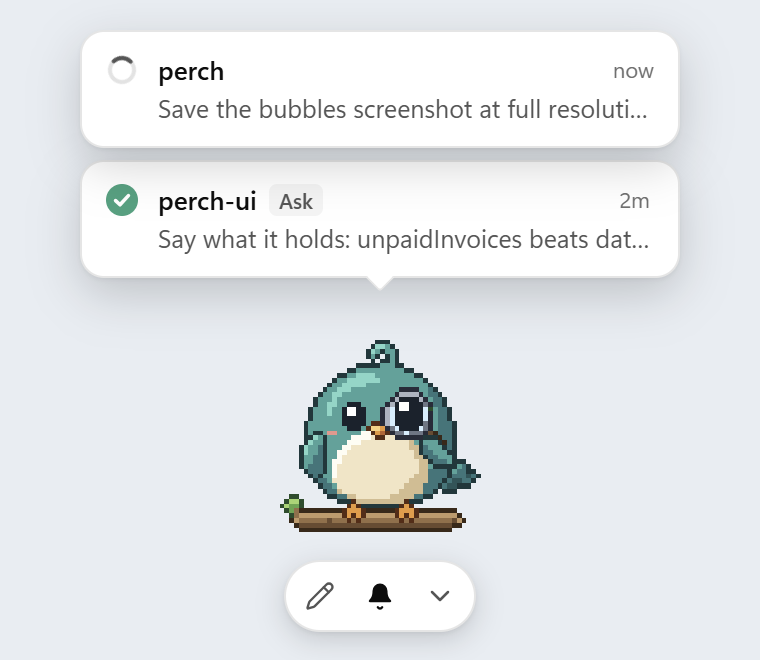
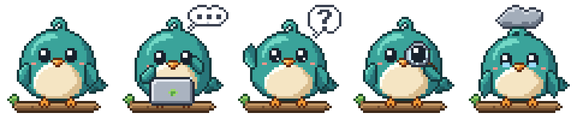
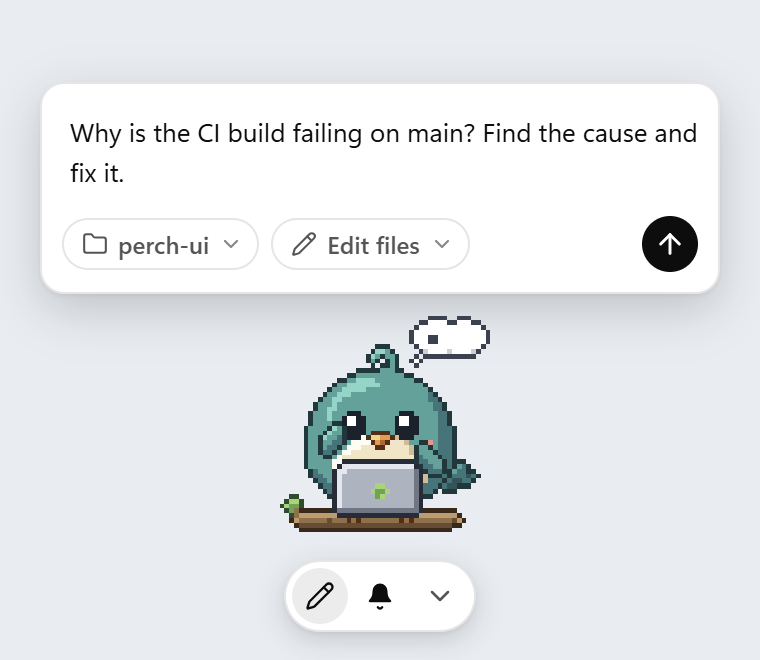
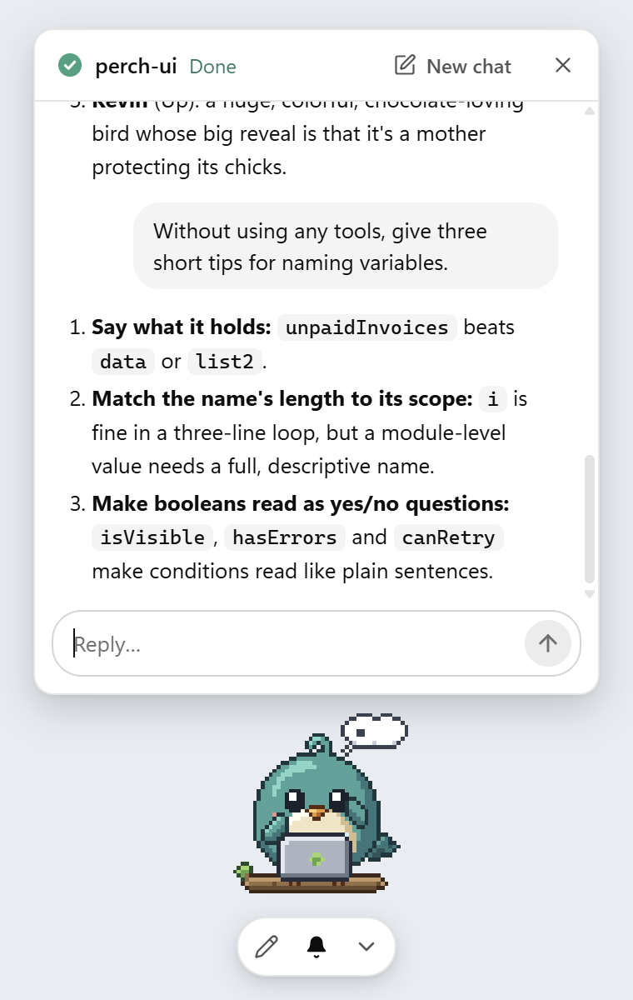
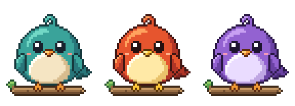

<p align="center"></p>

<h1 align="center">Perch</h1>

<p align="center">A pixel-art pet that floats on your desktop and keeps you posted on Claude Code.</p>

---

Perch sits above your other windows. It shows what every Claude Code session is doing, pops a card up when one finishes or needs you, and lets you ask Claude Code something without switching to VS Code or a terminal.

- **Watch.** Any Claude Code session (VS Code, terminal, desktop app) shows up as a card above the pet: running, needs input, ready or blocked. Click a card to jump back to that project.
- **Ask.** Click the pet or the pencil, pick a project folder and type. Perch runs your own Claude Code in that folder and streams the answer into a small chat above the pet. Follow-ups continue the same conversation.
- **It reacts.** The pet types while Claude works, holds up a "?" when it needs you, inspects the result when it's ready, and gets a little storm cloud when something fails. Drag it and it runs; hover and it waves.
- **Pick a pet.** Three pets are built in, and you can name yours. Perch also reads pets in the Codex pet format (see below).
- **Stays out of the way.** Everything around the pet is click-through, so the window never blocks what's behind it.

<p align="center"></p>

<table>
  <tr>
    <td align="center"><br><sub>Ask from the pet</sub></td>
    <td align="center"><br><sub>Answers stream into a mini chat</sub></td>
  </tr>
</table>

Free and open source (MIT). Perch is not affiliated with Anthropic.

## Requirements

- [Claude Code](https://code.claude.com) 2.1.259 or newer, logged in with a Claude subscription (Pro, Max, Team or Enterprise). The binary bundled with the VS Code extension works too.
- Windows 10/11 (primary), macOS or Linux (best effort).

## Install

Download the installer for your system from [Releases](../../releases). Perch walks you through setup on first run: pick and name your pet, let it watch your sessions, and check Claude Code.

The installers aren't code-signed yet:
- **Windows:** SmartScreen may say "Windows protected your PC". Click **More info → Run anyway**.
- **macOS:** right-click the app, choose **Open**, then **Open** again.

## Using it

| Do this | To |
|---|---|
| Click the pet, or the pencil | Ask Claude Code about a project |
| Click a card | Open that chat, or jump to the project in VS Code |
| Hover a card, click × | Mark it seen |
| Bell | Turn notifications on or off |
| Chevron | Collapse the cards (a badge shows the count) |
| Drag the pet | Move it (arrow keys nudge it, Esc sends it home) |
| Right-click the pet | Settings, change pet, hide for an hour, quit |
| Ctrl+Alt+P | Show or hide the pet |

## Pets

<p align="center"></p>

Perch uses the same sprite format as Codex pets: a 1536×1872 PNG or WebP atlas with 8 columns and 9 rows of 192×208 cells, plus a `pet.json`. Perch loads pets from:

- its own pets folder (**Settings → About → Open pets folder**)
- `~/.codex/pets` (or `$CODEX_HOME/pets`), so pets you already have in Codex show up in Perch too

Each pet is a folder with `pet.json` (`id`, `displayName`, `description`, `spritesheetPath`) and the sprite sheet. The built-in pets are generated from pixel maps in [`scripts/pets`](scripts/pets).

## Cost

Perch never uses an API key and has no login of its own. Asks run on your Claude subscription and use your plan's usage like any other prompt. Before every Ask, Perch checks that Claude Code is logged in with a subscription. It strips API-key environment variables from the process, and stops a run the moment Claude Code reports it would start drawing on paid usage credits.

## How watching works

On first run, Perch asks to add a few `http` hooks to your Claude Code `settings.json`. Each hook sends session events to `http://127.0.0.1:<port>/hook/<random token>` with a 2-second timeout. If Perch isn't running, the hook fails fast and Claude Code carries on. A backup of `settings.json` is saved before every change. **Settings → Remove hooks** removes exactly Perch's entries and nothing else.

## Privacy

Perch sends nothing anywhere itself. Its only network traffic is on localhost. Your prompts go to Anthropic through your own Claude Code, exactly as they would from a terminal.

## Develop

Needs Node.js 24 and stable Rust.

```bash
npm install
npm run tauri dev      # run the app
npm test               # frontend tests
npm run build && cargo test --manifest-path src-tauri/Cargo.toml   # Rust tests
```

Opening `npm run dev` in a normal browser shows the pet (`/?window=pet`) and settings (`/?window=settings`) with mock data.

To rebuild the built-in pets: `cd scripts/pets && npm install && node build.mjs && node validate.mjs`.

Design docs: [v0.1](docs/specs/2026-09-25-perch-design.md), [v0.2 redesign](docs/specs/2026-09-26-perch-v0.2-design.md).
