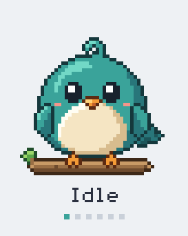
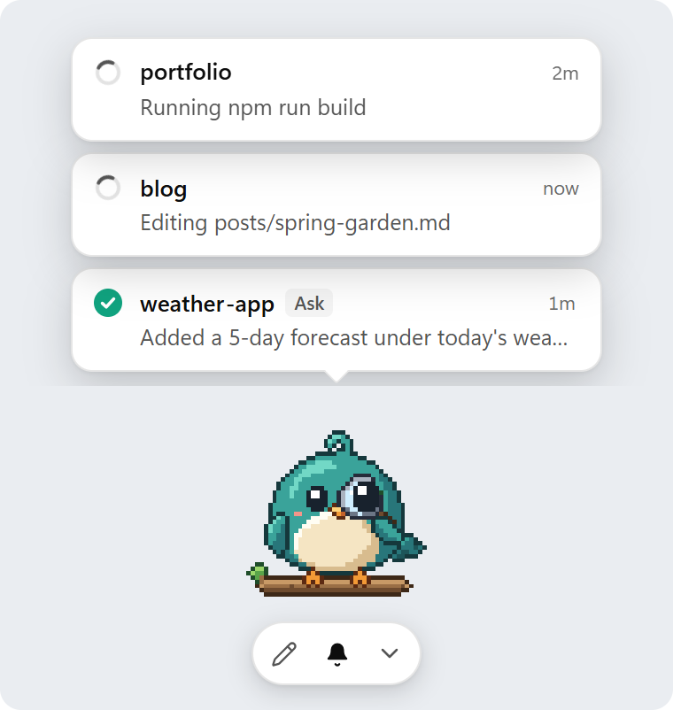
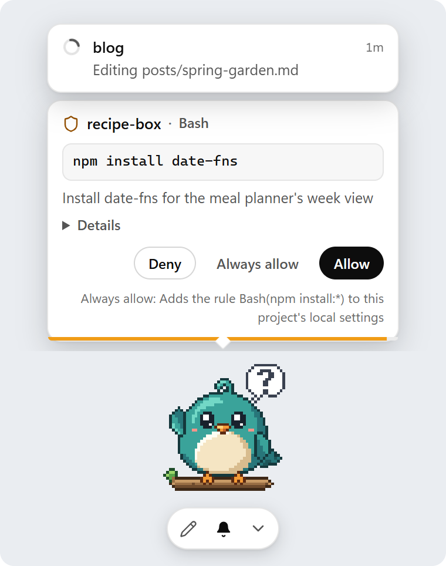
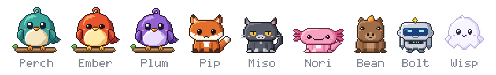
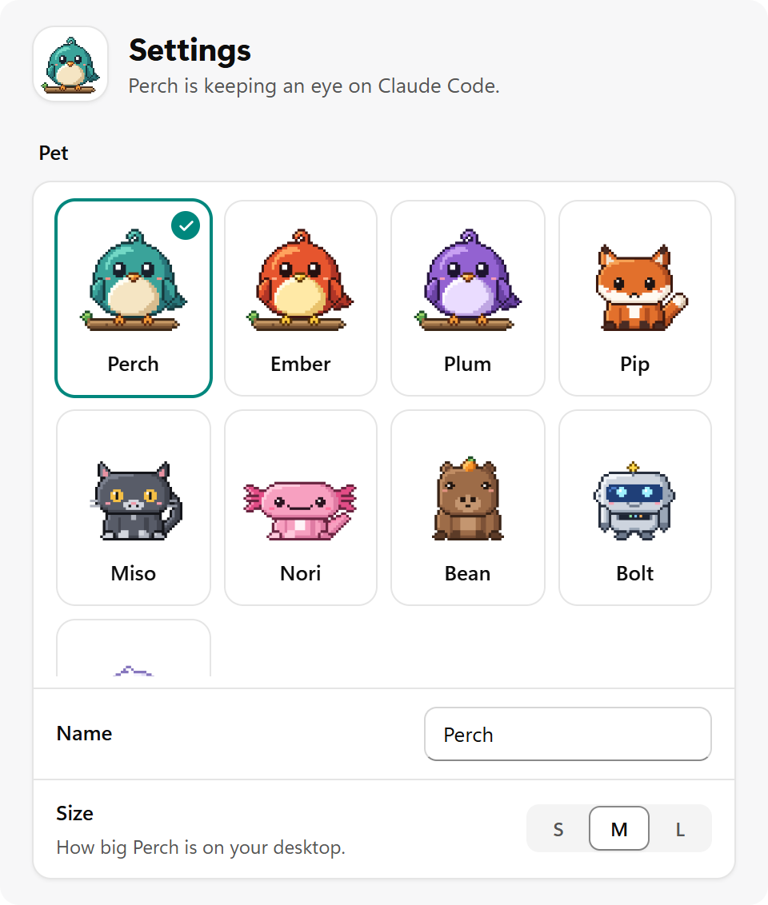

<h1 align="center">Devlings</h1>

<p align="center"><b>Desktop pets for Claude Code</b></p>

<p align="center">A pixel-art pet sits on your desktop, shows what each of your Claude Code sessions is doing, and lets you answer their permission prompts or ask Claude Code something without switching windows.</p>

<p align="center">
  <a href="https://github.com/ixklo/devlings/releases/latest"></a>
  <a href="LICENSE"></a>
  <a href="https://github.com/ixklo/devlings/actions/workflows/ci.yml"></a>
  
</p>

<p align="center">
  <picture>
    <source media="(prefers-color-scheme: dark)" srcset="docs/screenshots/demo-dark.gif">
    
  </picture>
</p>

## Download

| System | Installer |
|---|---|
| Windows (64-bit) | [Devlings-windows-x64-setup.exe](https://github.com/ixklo/devlings/releases/latest/download/Devlings-windows-x64-setup.exe) |
| Linux (x86_64), AppImage | [Devlings-linux-x86_64.AppImage](https://github.com/ixklo/devlings/releases/latest/download/Devlings-linux-x86_64.AppImage) |
| Linux (x86_64), Debian and Ubuntu | [Devlings-linux-amd64.deb](https://github.com/ixklo/devlings/releases/latest/download/Devlings-linux-amd64.deb) |
| macOS (Apple Silicon and Intel), beta | [Devlings-macos-universal.dmg](https://github.com/ixklo/devlings/releases/latest/download/Devlings-macos-universal.dmg) |

These links always get the latest version; older ones are on the [Releases](https://github.com/ixklo/devlings/releases) page. You need [Claude Code](https://code.claude.com) 2.1.259 or newer, logged in with a Claude subscription (Pro, Max, Team or Enterprise); the copy bundled with the VS Code extension works too. Windows 11 is tested on real hardware; Windows 10 hasn't been tried yet. macOS and Linux are beta: they build and launch in CI on every change but haven't been tried on real hardware, so an [issue](../../issues/new/choose) saying how it went is genuinely useful. Devlings is free and open source under the MIT license.

## Features

- **Every session on a card.** Each Claude Code session, in VS Code, a terminal or the desktop app, shows above the pet as working, needs you, done or failed. Click a card to jump back to its project.
- **A pet that reacts.** It types while Claude works, holds up a "?" when a session needs you, inspects the result when it's done, and sits under a storm cloud when something fails.
- **Answer permission prompts.** Allow or Deny a command, file edit or web fetch from a card that shows exactly what will run.
- **Ask from the desktop.** Click the pet, pick a project and type; your own Claude Code answers in a small chat above it, and follow-ups continue the conversation.
- **Notifications** when a session finishes, fails or needs you. On Windows, clicking one opens that session.
- **Out of the way.** Everything around the pet is click-through, and its buttons only appear when you hover over it or use it. Tuck the cards away and the Show threads button keeps count.
- **Calm.** Long runs and failures settle after a while; only "needs you" keeps moving until you answer. Reduced-motion settings are followed.
- **Nine pets, and your own.** Pick one, name it, or [draw a new one](docs/making-pets.md).
- **Keyboard and screen reader support** for the pet, its cards and Settings.
- **Updates itself** with signed updates, checked once a day (you can turn this off).
- **Runs on your subscription.** Never an API key. It talks only to Claude Code on your computer and to GitHub for updates.

<table>
  <tr>
    <td align="center" width="50%">
      <picture>
        <source media="(prefers-color-scheme: dark)" srcset="docs/screenshots/cards-dark.png">
        
      </picture>
      <br><sub>Every session at a glance</sub>
    </td>
    <td align="center" width="50%">
      <picture>
        <source media="(prefers-color-scheme: dark)" srcset="docs/screenshots/approval-dark.png">
        
      </picture>
      <br><sub>Permission prompts, answered from the pet</sub>
    </td>
  </tr>
  <tr>
    <td align="center">
      <picture>
        <source media="(prefers-color-scheme: dark)" srcset="docs/screenshots/composer-dark.png">
        
      </picture>
      <br><sub>Ask about any project</sub>
    </td>
    <td align="center">
      <picture>
        <source media="(prefers-color-scheme: dark)" srcset="docs/screenshots/chat-dark.png">
        
      </picture>
      <br><sub>Answers stream into a mini chat</sub>
    </td>
  </tr>
</table>

## Pets

<p align="center"></p>

| Pet | What it is |
|---|---|
| **Perch**, **Ember**, **Plum** | Round songbirds on a branch, in teal, orange and purple. Perch is the default. |
| **Pip** | A russet fox. Its tail swishes while it works. |
| **Miso** | A charcoal cat with amber eyes. Smug when it reviews, and it finishes with a big stretch. |
| **Nori** | A pink axolotl. Its frills flutter while it waits for you. |
| **Bean** | A calm capybara that balances an orange on its head while idle. |
| **Bolt** | A steel robot with a blue visor. Its antenna blinks while it works. |
| **Wisp** | A soft white ghost that floats, and fades a little when things are quiet. |

To switch, right-click the pet and choose **Change pet**, or pick one in **Settings → Pet**. A name you gave your pet stays when you switch; otherwise the new pet brings its own.

<p align="center">
  <picture>
    <source media="(prefers-color-scheme: dark)" srcset="docs/screenshots/settings-dark.png">
    
  </picture>
</p>

### Make your own pet

A pet is a folder with a small `pet.json` and one spritesheet image. [Making a pet](docs/making-pets.md) explains the format, has a blank template to draw on, and shows where to put the folder.

## Using it

| Do this | To |
|---|---|
| Click the pet, or the pencil | Ask Claude Code about a project |
| Click a card | Open that chat, or jump to the project (VS Code if found, otherwise the folder) |
| Hover a card, click × | Mark it seen |
| Deny, Allow or Always allow on a permission card | Answer that permission prompt (click only; no key answers it) |
| Bell | Turn notifications on or off |
| Chevron (Hide threads) | Tuck the cards away. While they're hidden, the Show threads button shows a count: how many sessions need you (amber), else how many are blocked (red), else how many are hidden |
| Drag the pet | Move it (arrow keys nudge it, Esc sends it home) |
| Right-click the pet | Settings, Change pet, Hide for 1 hour, Quit |
| Ctrl+Alt+P (Cmd+Option+P on macOS) | Show or hide the pet |
| Tab, Enter or Space, Esc | Use the pet, its cards and Settings from the keyboard (the menu key opens the pet's menu) |

Screen readers hear each status change once, for example "blog: needs input". Clicking a notification opens its session on Windows only for now; on macOS and Linux notifications appear, but clicking one does nothing.

## How it works

- **Watching.** On first run Devlings asks to add a few hooks to Claude Code's `settings.json`. Claude Code then reports each session's events to a small server Devlings runs on `127.0.0.1` (your computer only), protected by a random token. If Devlings isn't running, the hooks fail fast and silently, and Claude Code carries on as usual. A backup of `settings.json` is saved before every change.
- **Asking.** Devlings runs your own Claude Code in the project folder (`claude -p`) and streams the answer into the chat. It never uses an API key of its own.
- **Answering permission prompts.** When Claude Code asks to run something, Devlings shows the request as a card and sends your answer back over the same local connection.

<details>
<summary>More on permission prompts</summary>

- **What you see.** The project, the tool, the exact command, file path or URL, and Claude's own description. **Details** shows everything the tool will receive (a file's new content, an edit's old and new text); it opens by itself when the headline leaves something out, for example for MCP tools, and a badge marks risky flags such as running outside the sandbox.
- **No accidental answers.** Nothing is pre-selected and no key answers a card. The buttons only work once the card has sat still for a moment, so a card that just appeared or moved can't catch a click meant for something else. A request too big to show in full only offers **Deny**; answer it in Claude Code instead.
- **Asks from Devlings:** always on, and shown in the mini chat too. **Stop** or **New chat** turns down anything still waiting; a request nobody answers is turned down after 10 minutes.
- **Your other sessions** (VS Code, the terminal): opt-in, under **Settings → Approvals**. Claude Code's own prompt appears at the same time and keeps working, and whichever answers first wins. Devlings keeps the card for 30 seconds, 1, 2 or 4 minutes (1 minute by default); after that the request simply waits in Claude Code. While this is on, a headless `claude -p` run started by some other tool waits that long for an answer in Devlings, then Claude Code turns the tool down, as it would without Devlings.
- **Always allow** appears only when Claude Code suggests a rule, applies exactly that suggestion, and the line under it says what it does ("Adds the rule Bash(npm test:*) to this project's local settings"). When every suggestion only lasts for the session, it reads **Allow for this session**. A mode switch is only offered for the session, and never to the mode that skips all permission checks.
- **Questions and plans** are left to Claude Code's own dialog in your other sessions. In an Ask, Devlings tells Claude to make a reasonable assumption and say so, or to present the plan in the chat.

</details>

<details>
<summary>The hooks in detail</summary>

- Most events are `http` hooks to `http://127.0.0.1:<port>/hook/<token>` with a short timeout.
- `Stop`, `StopFailure` and `SessionEnd` run Devlings itself as a tiny relay (`devlings --hook-relay …`) that always exits within about a second, because Claude Code shows an error for those events when an `http` hook can't connect. Quitting Devlings never adds noise or delay to Claude Code.
- The `PermissionRequest` hook allows up to 5 minutes, so a card can stay open while you decide. It only waits while **Settings → Approvals** is on; otherwise Devlings replies "no decision" at once.
- Devlings never rewrites `settings.json` on start or quit. **Settings → Watching → Remove** takes out exactly its own entries.

</details>

## Cost

Devlings is free, never uses an API key and has no account of its own.

- **Watching is free.** It only listens to Claude Code's hooks; no prompts are sent.
- **Asks use your Claude subscription.** Anthropic meters non-interactive Claude Code (`claude -p`) separately from interactive use: it draws on a monthly Agent SDK credit that comes with paid plans and that you claim once in your Claude account. If the credit runs out and paid usage credits are off, Asks stop until it refreshes; interactive Claude Code isn't affected. See [Anthropic's help article](https://support.claude.com/en/articles/15036540) for the current amounts.
- **Plan usage.** **Settings → Cost** shows how much of your plan's limit is used, as Claude Code reported it during your last Ask, with the time it was seen. Devlings makes no extra requests for it.
- **Guards.** Before every Ask, Devlings checks that Claude Code is logged in with a subscription and strips API-key environment variables. It stops a run the moment Claude Code reports it would start using paid usage credits.

## Privacy

- **What it reads:** Claude Code's hook events for your sessions (the step, the status, a line of the reply, and a permission request's input); the conversation file of each Ask; Claude Code's `settings.json` (to add and remove its hooks) and its list of trusted folders (never changed); and, when you Ask in a folder you haven't trusted, that folder's Claude Code settings, to tell you what was skipped. It doesn't read your source files.
- **What it sends:** hook answers go to Claude Code on `127.0.0.1`. The only thing that leaves your computer is a daily check for a new version, which downloads a small `latest.json` from this repository's releases on GitHub (turn it off in **Settings → About**). Your prompts go to Anthropic through your own Claude Code, exactly as from a terminal.
- On Windows, Devlings' windows are drawn by Microsoft's WebView2 runtime, which makes its own connections to Microsoft as it does for every app built on it. Devlings' pages never load anything from the internet.

<details>
<summary>Folders you haven't trusted</summary>

Claude Code asks before it trusts a new folder, but the non-interactive runs behind Asks can't ask. So when you Ask in a folder Claude Code hasn't trusted (inside a git repository, the repository itself or a folder in it; trusting a parent such as your home folder doesn't count) and that folder has its own Claude Code setup (a `.claude` folder or a `.mcp.json`), Devlings runs Claude Code without the folder's project settings: its hooks, environment variables, helper commands such as `apiKeyHelper`, MCP servers and project skills are skipped. The chat says exactly what was skipped (environment variables by name only) and offers to trust the folder in Devlings; undo it with **Stop trusting** in the chat or under **Settings → Trusted folders**. Devlings never changes Claude Code's own trust list.

</details>

See [SECURITY.md](SECURITY.md) for the security scope and how to report an issue.

## Install

Devlings walks you through setup on first run, in three steps: pick and name your pet and let it watch your sessions, see how asking works (with a check that Claude Code is ready), and choose whether it answers permission prompts for your other sessions.

The installers aren't signed with a paid certificate, so each system warns the first time:

- **Windows:** SmartScreen says "Windows protected your PC". Click **More info**, then **Run anyway**.
- **macOS:** Gatekeeper blocks the first launch. Open **System Settings → Privacy & Security**, scroll down and click **Open Anyway** next to Devlings, then confirm. (Since macOS 15, Control-click → Open no longer gets past this. The app is ad-hoc signed, not notarized.)
- **Linux (AppImage):** make it executable first (`chmod +x Devlings*.AppImage`), then run it.
- **Linux (.deb):** `sudo apt install ./Devlings*.deb`, or open it in a graphical package installer.

**Updates:** Devlings checks GitHub at launch and once a day and installs signed updates in-app; turn this off in **Settings → About**. Coming from a 0.x release takes one manual install; in-app updates take over after that.

## Upgrading from Perch

Devlings used to be called Perch (up to 1.0). Your pet, its name, your projects, settings and Claude Code hooks all carry over, and Perch the teal bird is still here as the default pet.

- **Windows:** install Devlings over Perch, or let Perch's in-app update do it. The installer closes and removes Perch (keeping your settings and hooks), its shortcuts and its start-at-login entry. On first launch Devlings points the hooks in `settings.json` at itself (after a backup) and turns start-at-login back on if you had it on.
- **macOS:** Devlings is a separate app. Quit Perch, install Devlings, then drag **Perch** out of Applications. If Perch started at login, also delete `~/Library/LaunchAgents/Perch.plist`.
- **Linux:** quit Perch and install Devlings, then remove Perch (`sudo apt remove perch`, or delete the Perch AppImage). If Perch started at login, also delete `~/.config/autostart/Perch.desktop`.

Don't run both: they share one settings folder, and whichever starts second just brings up the first.

## Uninstall

- **Windows:** run the uninstaller (Start menu or **Settings → Apps**). It removes exactly the hooks Devlings added to `settings.json` and its start-at-login entry, then the app.
- **macOS and Linux:** first open **Settings → Watching → Remove**, which takes Devlings' hooks out of `settings.json` (a backup is kept next to it). Then delete the app: drag it out of Applications, or remove the AppImage or the `.deb`.

## Troubleshooting

- **Cards never update.** Check that **Settings → Watching** says the hooks are installed, or click **Install**. Then restart the Claude Code session (hooks are read when a session starts), and check that nothing else removed Devlings' entries from `~/.claude/settings.json`.
- **"Port in use" under Settings → Watching.** Something else is using Devlings' port. Click **Move port**: Devlings picks a new one and updates its hooks.
- **"Claude Code not found" during setup.** Click **Choose file…** and point it at `claude` (or `claude.exe`), or **Auto-detect** to look again. The VS Code extension's copy works too.
- **No notifications on Windows.** If Windows has them turned off for all apps or for Devlings, the Notifications switch in Settings says so and where to turn them on.
- **SmartScreen or Gatekeeper** blocks the installer or the app: see [Install](#install).

Still stuck? Open an [issue](../../issues/new/choose) and attach **Settings → About → Copy diagnostics** (it leaves out your hook token and home folder).

## FAQ

**Does it slow Claude Code down, or break it when Devlings is closed?**
No. The hooks have short timeouts and fail silently when Devlings isn't running, and the relay for the last few events exits within about a second.

**Which sessions does it see?**
Every Claude Code session that reads your user `settings.json`: the VS Code extension, the terminal and the desktop app.

**Can I hide it for a while?**
Right-click the pet and choose **Hide for 1 hour**, press Ctrl+Alt+P, or tuck the cards away with the chevron.

**Can I use my own pet?**
Yes: see [Making a pet](docs/making-pets.md).

## Contributing

Bug reports, ideas and pull requests are welcome; [CONTRIBUTING.md](CONTRIBUTING.md) has the details. To work on it you need Node.js 24 and stable Rust:

```bash
npm install
npm run tauri dev      # run the app
npm test               # frontend and script tests
npm run build && cargo test --manifest-path src-tauri/Cargo.toml   # Rust tests
```

`npm run dev` in a normal browser shows the pet (`/?window=pet`) and Settings (`/?window=settings`) against a fake backend. Design docs live in [`docs/specs`](docs/specs) (the app was called Perch up to 1.0).

## License

MIT, see [LICENSE](LICENSE). Devlings bundles open-source Rust crates and npm packages, listed with their licenses in [THIRD_PARTY_NOTICES.md](THIRD_PARTY_NOTICES.md) (also linked from **Settings → About**).

Devlings is an independent project and is not affiliated with Anthropic.
