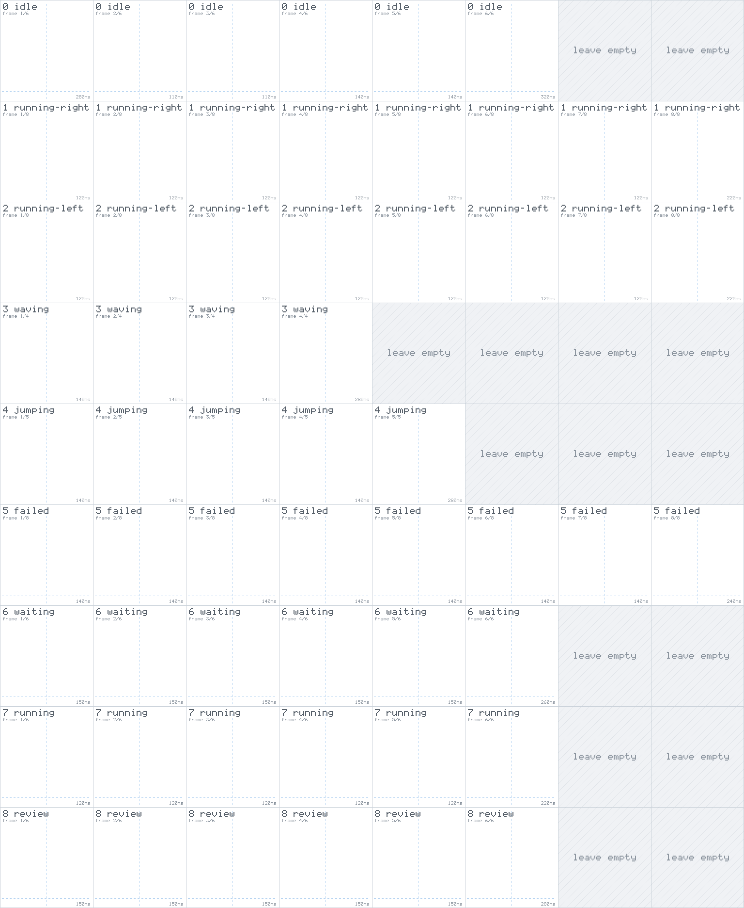

# Making a pet

A Devlings pet is a folder with two files: a small `pet.json` and one spritesheet image holding every frame of every animation. Draw the sheet, drop the folder into Devlings' pets folder, and pick the pet like any built-in one.

Pets made for Codex work too. They use the same format: Devlings also reads `~/.codex/pets` (or `$CODEX_HOME/pets`), and a Codex pet folder can go into Devlings' pets folder as it is.

## Where pets go

Open **Settings → About**, and next to **More pets** click **Open folder**. Devlings creates the folder if it isn't there yet. It is:

| System | Pets folder |
|---|---|
| Windows | `%APPDATA%\io.github.perchpet.perch\pets` |
| macOS | `~/Library/Application Support/io.github.perchpet.perch/pets` |
| Linux | `~/.local/share/io.github.perchpet.perch/pets` (or `$XDG_DATA_HOME/io.github.perchpet.perch/pets`) |

(`io.github.perchpet.perch` is the app's internal id, kept from when it was called Perch.)

Each pet is one folder inside it:

```
pets/
  pebble/
    pet.json
    spritesheet.png
```

To pick it, right-click the pet → **Change pet**: the menu looks in the pets folders every time it opens, so a new pet is there straight away. The picker in **Settings → Pet** keeps the list it loaded earlier, so it may only show a new pet after you restart Devlings.

## pet.json

```json
{
  "id": "pebble",
  "displayName": "Pebble",
  "description": "A small grey rock that watches your builds.",
  "spritesheetPath": "spritesheet.png"
}
```

| Field | Required | What it does |
|---|---|---|
| `id` | No | A short unique name for the pet, up to 64 characters. Defaults to the folder's name. If two pets share an id, the built-in one wins, then the one in Devlings' folder, then the one in the Codex folder, so give yours its own. |
| `displayName` | No | The name under the pet in the picker and the menu, and the pet's name when you switch to it (unless you gave your pet a name of your own). Defaults to the id. |
| `description` | No | One line, shown when you hover the pet in the picker. |
| `spritesheetPath` | No | The sheet's file name, relative to the folder. It has to stay inside the folder (no `..`, no absolute path, not a symlink). Without it, Devlings looks for `spritesheet.webp`, then `spritesheet.png`. |

## The spritesheet

One PNG or WebP image, **exactly 1536 × 1872 pixels** and at most 20 MiB: a grid of **8 columns × 9 rows**, each cell **192 × 208 pixels**. Each row is one animation, read left to right from the first column. A row with fewer frames than 8 leaves the rest of its cells empty (transparent). Everything outside the pet should be transparent.

| Row | Name | When it plays | Frames | Each frame shows for (ms) |
|---|---|---|---|---|
| 0 | `idle` | Nothing is going on. It plays, then rests on frame 1 for a few seconds. | 6 | 280, 110, 110, 140, 140, 320 |
| 1 | `running-right` | Being dragged to the right. | 8 | 120 × 7, then 220 |
| 2 | `running-left` | Being dragged to the left. | 8 | 120 × 7, then 220 |
| 3 | `waving` | Once, when the pointer comes over the pet, and as a hello when you're back at the computer (Windows). | 4 | 140, 140, 140, 280 |
| 4 | `jumping` | Once, when a session finishes. | 5 | 140 × 4, then 280 |
| 5 | `failed` | A session failed or is blocked. | 8 | 140 × 7, then 240 |
| 6 | `waiting` | A session needs you (a permission prompt or a question), or Devlings needs setting up. | 6 | 150 × 5, then 260 |
| 7 | `running` | Claude Code is working. | 6 | 120 × 5, then 220 |
| 8 | `review` | A session is done and its result is ready. | 6 | 150 × 5, then 280 |

The timings are fixed, so you only draw the frames. A few things worth knowing while you draw:

- **Frame 1 of each row is the resting pose.** Long states settle down after a while and hold frame 1 between plays (idle from the start, `running` after a minute, `failed` after a few seconds, `review` after 20 seconds), and with reduced motion turned on Devlings shows only frame 1 of each row. `waiting` never rests.
- **Keep the feet in one place** across `idle`, `waiting`, `running`, `review` and `failed`, so the pet doesn't hop when its mood changes. The built-in pets stand with their feet at y = 188 in the cell.
- **Leave a little room at the edges** of each cell, so nothing touches the next frame.
- **Chunky pixels look best.** Devlings draws the sheet with crisp, nearest-neighbour scaling at about 45, 60 or 80 % of its size (**Settings → Pet → Size**), times your screen's scaling. The built-in pets are drawn in 4 × 4-pixel blocks; fine, smooth detail can look grainy at small sizes.

### A template to draw on

[`docs/pets/template.png`](pets/template.png) is a 1536 × 1872 guide: every cell outlined and labelled with its row, frame number and timing, the cells a row doesn't use hatched, and faint lines for the middle of the cell and for where the built-in pets' feet go.

<p align="center"></p>

Put it on a layer under your drawing and hide it before you export, so the finished sheet is transparent everywhere except the pet.

Another way to start is to copy a built-in pet from [`src-tauri/pets`](../src-tauri/pets), give the folder and `id` a new name, and paint over its sheet. The contact sheets in [`docs/pets`](pets) show every frame of every built-in pet.

## If your pet doesn't show up

Devlings skips a pet it can't load and writes the reason to its log, as a line starting with `Skipping pet:`. Open it with **Settings → About → Open log folder**. The usual reasons:

- the image isn't exactly 1536 × 1872, isn't a PNG or WebP, or is over 20 MiB;
- `pet.json` isn't valid JSON;
- `spritesheetPath` points outside the folder, or at a symlink;
- the pet has the same `id` as a built-in pet (the built-in one wins).

Devlings keeps a pet's sheet in memory once it's loaded, so after you change the art, quit Devlings (right-click the pet → **Quit**) and start it again to see it.

## Checking a sheet against the built-in pets' rules

The repository has the validator the built-in pets are checked with. With Node.js installed and the repository cloned:

```bash
cd scripts/pets
npm install
node validate.mjs path/to/pebble
```

It reads PNG sheets only, and it's stricter than Devlings: it also wants all four `pet.json` fields with an `id` matching the folder, fully opaque or fully transparent pixels on a 4 × 4 grid, a 2-pixel empty margin in every cell, empty unused cells, and the feet within 2 art pixels of the same line. Devlings loads pets that break those style rules, so treat them as advice.
